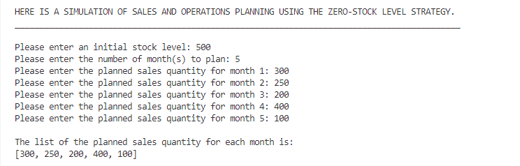
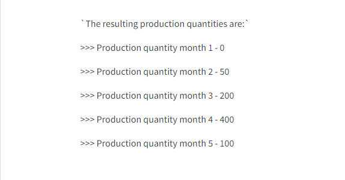

# **SALES AND OPERATIONS PLANNING**

## Project Requirements

In this project, you are going to simulate a sales and operations plan using the zero-stock level strategy.

Write a python program that asks the user to enter the following data:

- An initial stock level for a product
- The number of month(s) to plan
- The planned sales quantity for each month

Based on this data, calculate the required production quantity as follows:

- If the sales quantity is smaller than the stock level of the previous month, the production quantity is 0
- If the sales quantity is larger than the stock level of the previous month, the production quantity is the difference

# Program coding process

## **Step 1️⃣**

Assign three input functions to three variables to prompt for user's input.
All three user's inputs must be integers. The variables are:

- initial_stock: The initial stock level
- months_to_plan: The number of months to plan Sales and Operations
- monthly_sales_planned: The planned sales quantity for each month

Use a loop (while loop) to make the code dynamic, so that it automatically prompts the user for the planned sales quantity input for each month till the last month to plan (i.e., for month 1 to month 5, if there are 5 months to plan)

Assign an empty list to a variable (sales_quantity)
Append each month's planned sales quantity input from the user to the list using the loop

## **Step 2️⃣**

Assign two empty lists to two variables

- One list will contain the stocks of each month (stock_list)
- The other will contain the resulting production quantities for each month (production_quantity)

Append (add) the initial stock to the stock_list

First condition:

1. If current month stock level is larger than sales quantity of following month;
2. Following month stock level = current month stock level - sales quantity of following month and,
3. The current month production cost is zero (0)

Create a while loop to iterate through all the values of the stock_list and sales_quantity lists to check whether condition one is met.

If the condition is met, the while loop above calculates the stock levels and production quantities and inserts (appends) them into the (stock_list) list and (production_quantity) list respectively.

## **Step 3️⃣**

Second condition:

1. If current month stock level is smaller than sales quantity of following month
2. Following month stock level is zero (0)
3. The current month production cost = sales quantity of following month - current month stock level

Create a while loop to iterate through all the values of the stock_list and sales_quantity lists to check whether condition one is met.

If the condition is met, the loop calculates the stock levels and production quantities and inserts (appends) them into the (stock_list) list and (production_quantity) list respectively.

To stop the loops from running indefinitely, there needs to be a statement that terminates the loop when it iterates through all the values in the lists.

## Example

Below is an example of the program's execution

## Why the production quantities are calculated

Using the example above;

- In the first month, 300 pieces are sold.

Since the initial stock is 500, nothing needs to be produced. The resulting stock is 200: (500-300)

- In the second month, 250 pieces are sold.

The stock level from the previous month is 200, therefore, 50 pieces need to be produced. The resulting stock level is 0: (200+50-250)

- In the third month, 200 pieces are sold.

The stock level from the previous month is 0, therefore, 200 pieces need to be produced. The resulting stock level is 0: (200-200)

🔚🔚🔚🔚🔚🔚🔚🔚🔚🔚🔚🔚🔚🔚🔚🔚🔚🔚🔚🔚
----------------------------------------
